p8106\_hw2\_jsg2145
================
Jared Garfinkel
3/16/2020

``` r
collegedf = read_csv("./data/College.csv") %>% 
  janitor::clean_names() %>% 
  mutate(college = factor(college)) %>% 
  select(outstate, everything())
```

    ## Parsed with column specification:
    ## cols(
    ##   College = col_character(),
    ##   Apps = col_double(),
    ##   Accept = col_double(),
    ##   Enroll = col_double(),
    ##   Top10perc = col_double(),
    ##   Top25perc = col_double(),
    ##   F.Undergrad = col_double(),
    ##   P.Undergrad = col_double(),
    ##   Outstate = col_double(),
    ##   Room.Board = col_double(),
    ##   Books = col_double(),
    ##   Personal = col_double(),
    ##   PhD = col_double(),
    ##   Terminal = col_double(),
    ##   S.F.Ratio = col_double(),
    ##   perc.alumni = col_double(),
    ##   Expend = col_double(),
    ##   Grad.Rate = col_double()
    ## )

``` r
college.train = collegedf %>% 
  filter(college != "Columbia University")
```

``` r
x.train = model.matrix(outstate ~ apps + accept + enroll + top10perc + top25perc + f_undergrad + p_undergrad + room_board + books + personal + ph_d + terminal + s_f_ratio + perc_alumni + expend + grad_rate, college.train)[,-1]

y.train = pull(college.train, outstate)

ctrl1 = trainControl(method = "repeatedcv", number = 10, repeats = 5)
```

``` r
college.pcr = train(x.train, y.train,
                    method = "pcr",
                    tuneLength = ncol(college.train),
                    trControl = ctrl1,
                    preProc = c("center", "scale"))
```

``` r
ggplot(college.pcr, highlight = TRUE)
```


``` r
cv.lasso = cv.glmnet(x.train, y.train, 
                     type.measure = "mse", 
                     alpha = 1, 
                     lambda = exp(seq(2, 5, length = 100)))

plot(cv.lasso)
```


``` r
cv.ridge = cv.glmnet(x.train, y.train, 
                     type.measure = "mse", 
                     alpha = 0, 
                     lambda = exp(seq(3, 8, length = 100)))

plot(cv.ridge)
```


``` r
college.lasso = train(x.train, y.train,
                    method = "glmnet",
                    tuneGrid = expand.grid(alpha = 1, 
                                          lambda = exp(seq(2, 5, length = 100))),
                    trControl = ctrl1)
```

``` r
college.ridge = train(x.train, y.train,
                    method = "glmnet",
                    tuneGrid = expand.grid(alpha = 0, 
                                          lambda = exp(seq(3, 8, length = 100))),
                    trControl = ctrl1)
```

``` r
college.lm <- train(x.train, y.train,
                method = "lm",
                trControl = ctrl1)
```

``` r
resamp <- resamples(list(lasso = college.lasso, 
                         ridge = college.ridge, 
                         pcr = college.pcr,
                         lm = college.lm))

summary(resamp)
```

    ## 
    ## Call:
    ## summary.resamples(object = resamp)
    ## 
    ## Models: lasso, ridge, pcr, lm 
    ## Number of resamples: 50 
    ## 
    ## MAE 
    ##           Min.  1st Qu.   Median     Mean  3rd Qu.     Max. NA's
    ## lasso 1283.696 1481.539 1575.978 1581.898 1705.235 1969.211    0
    ## ridge 1321.323 1513.822 1585.885 1598.081 1692.644 1901.975    0
    ## pcr   1300.244 1476.496 1602.242 1605.337 1727.411 2105.573    0
    ## lm    1378.815 1487.060 1562.328 1586.295 1640.186 2036.547    0
    ## 
    ## RMSE 
    ##           Min.  1st Qu.   Median     Mean  3rd Qu.     Max. NA's
    ## lasso 1616.163 1819.757 1988.162 1981.671 2113.350 2621.533    0
    ## ridge 1596.547 1866.929 1969.795 1996.851 2154.031 2535.219    0
    ## pcr   1621.257 1797.719 2018.651 2006.485 2172.118 2816.105    0
    ## lm    1707.122 1835.837 1965.584 1990.125 2025.360 2763.962    0
    ## 
    ## Rsquared 
    ##            Min.   1st Qu.    Median      Mean   3rd Qu.      Max. NA's
    ## lasso 0.5123977 0.6787984 0.7232939 0.7181112 0.7638901 0.8158355    0
    ## ridge 0.6138583 0.6734086 0.7114164 0.7148305 0.7512834 0.8325021    0
    ## pcr   0.5215324 0.6740952 0.7095816 0.7111883 0.7655773 0.8210213    0
    ## lm    0.5983290 0.6844232 0.7318576 0.7201507 0.7585120 0.8287809    0

``` r
bwplot(resamp, metric = "RMSE")
```


``` r
college.train %>% 
  ggplot(aes(x = apps, y = outstate)) +
  geom_point()
```


``` r
college.train %>% 
  ggplot(aes(x = accept, y = outstate)) +
  geom_point()
```


``` r
college.train %>% 
  ggplot(aes(x = enroll, y = outstate)) +
  geom_point()
```

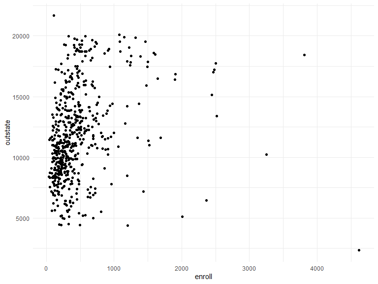

``` r
college.train %>% 
  ggplot(aes(x = top10perc, y = outstate)) +
  geom_point()
```

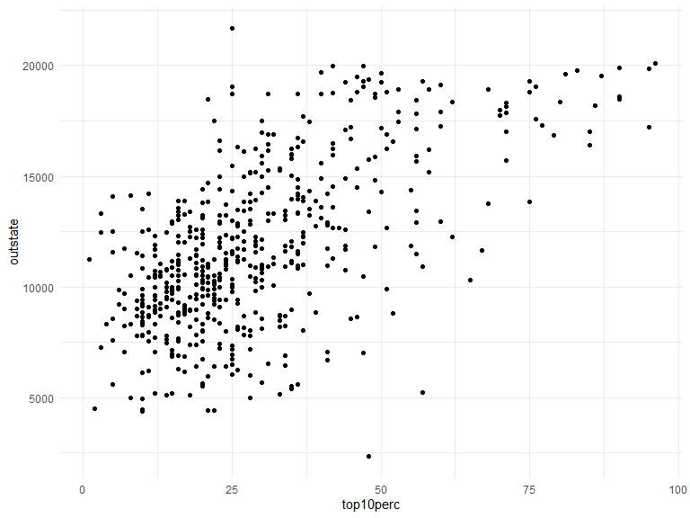

``` r
college.train %>% 
  ggplot(aes(x = top25perc, y = outstate)) +
  geom_point()
```

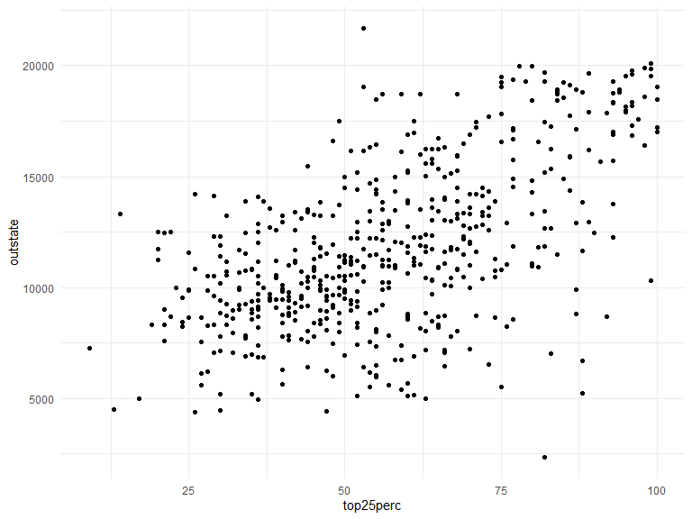

``` r
college.train %>% 
  ggplot(aes(x = f_undergrad, y = outstate)) +
  geom_point()
```

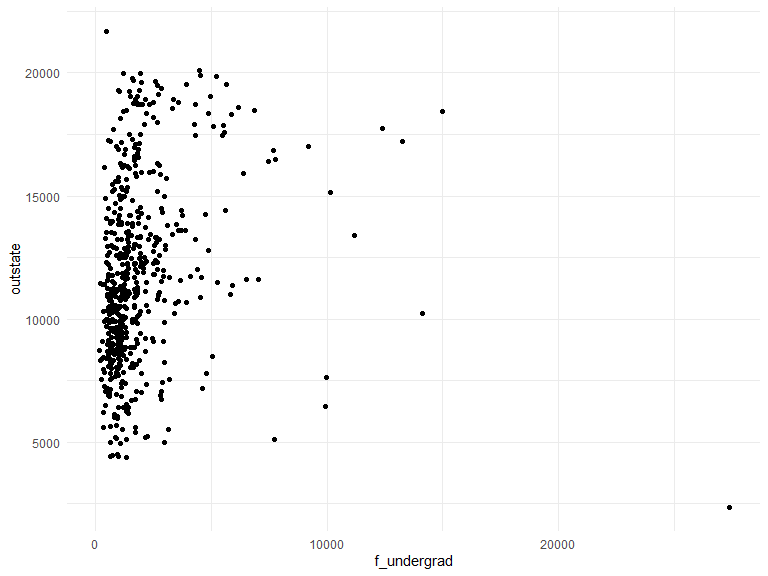

``` r
college.train %>% 
  ggplot(aes(x = p_undergrad, y = outstate)) +
  geom_point()
```

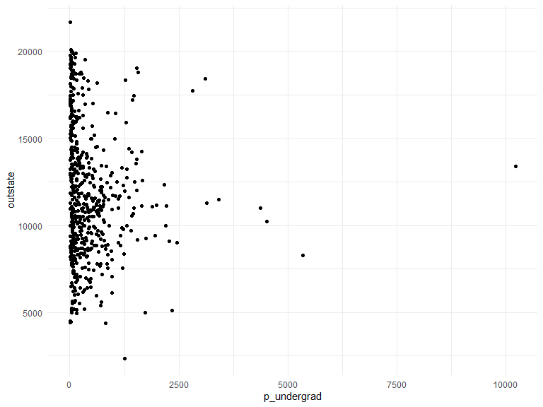

``` r
college.train %>% 
  ggplot(aes(x = room_board, y = outstate)) +
  geom_point()
```

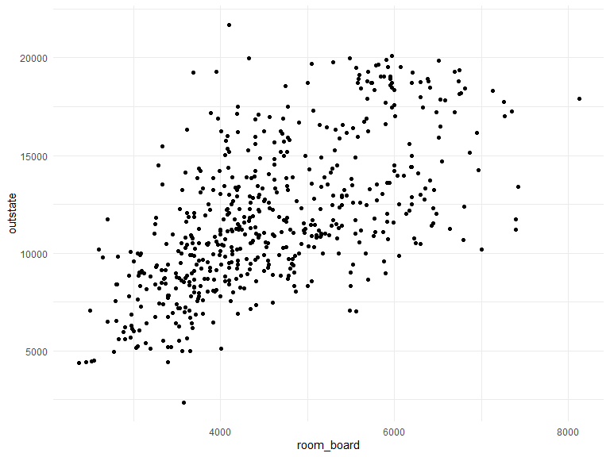

``` r
college.train %>% 
  ggplot(aes(x = books, y = outstate)) +
  geom_point()
```

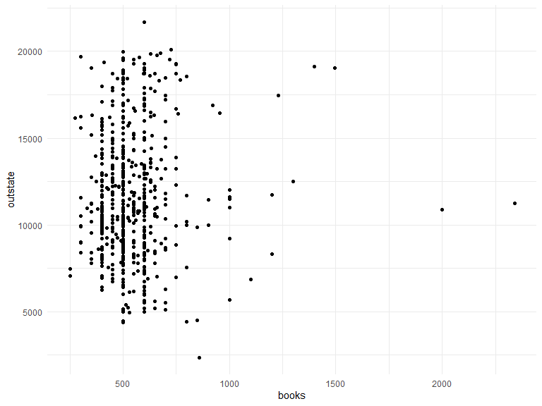

``` r
college.train %>% 
  ggplot(aes(x = ph_d, y = outstate)) +
  geom_point()
```

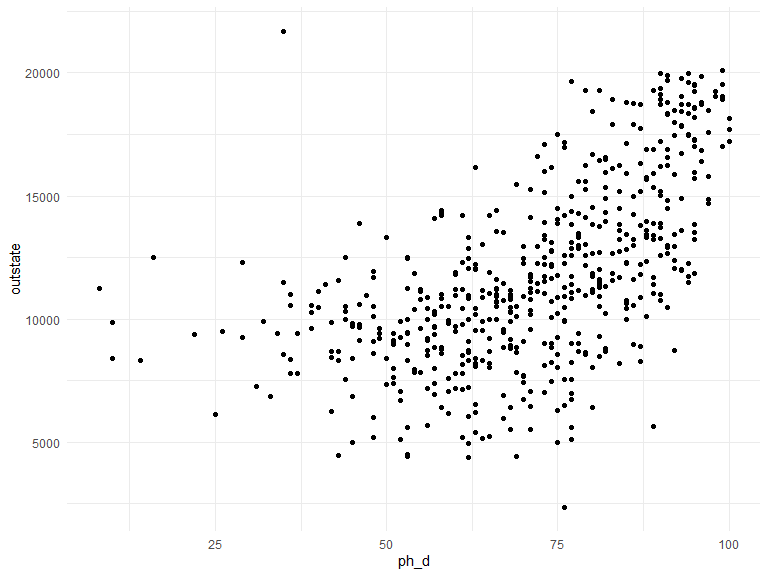

``` r
college.train %>% 
  ggplot(aes(x = personal, y = outstate)) +
  geom_point()
```

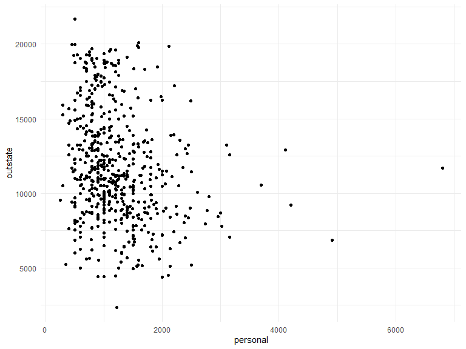

``` r
college.train %>% 
  ggplot(aes(x = terminal, y = outstate)) +
  geom_point()
```

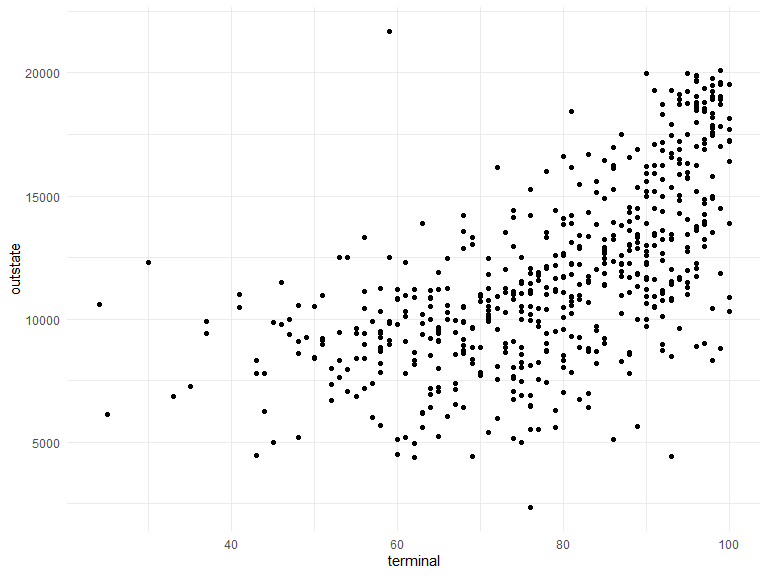

``` r
college.train %>% 
  ggplot(aes(x = s_f_ratio, y = outstate)) +
  geom_point()
```

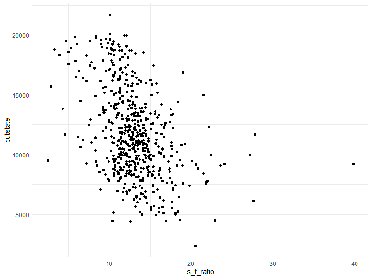

``` r
college.train %>% 
  ggplot(aes(x = perc_alumni, y = outstate)) +
  geom_point()
```

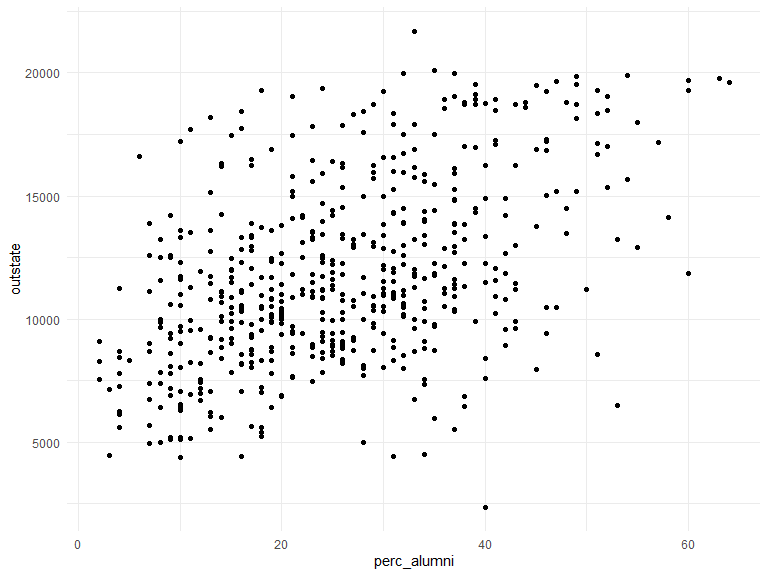

``` r
college.train %>% 
  ggplot(aes(x = grad_rate, y = outstate)) +
  geom_point()
```

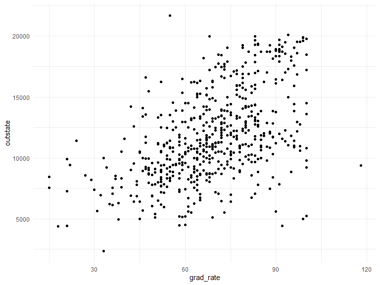

``` r
college.train %>% 
  ggplot(aes(x = expend, y = outstate)) +
  geom_point()
```

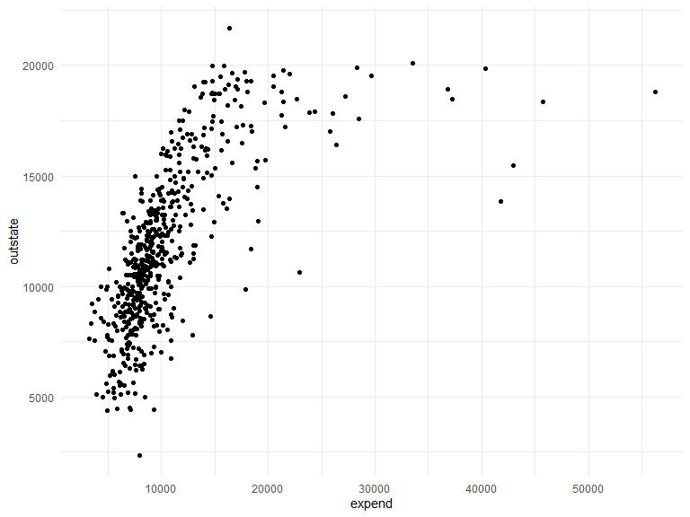
