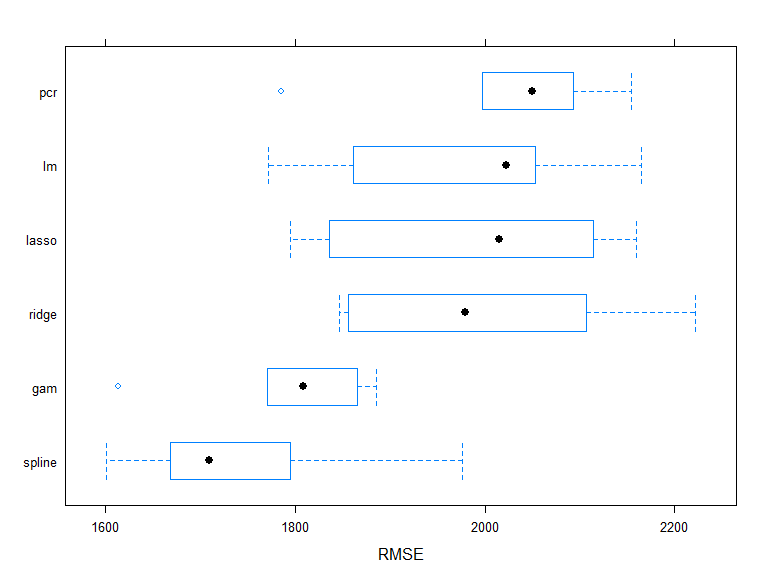

p8106\_hw2\_jsg2145
================
Jared Garfinkel
3/16/2020

``` r
collegedf = read_csv("./data/College.csv") %>% 
  janitor::clean_names() %>% 
  mutate(college = factor(college)) %>% 
  select(outstate, everything())
```

    ## Parsed with column specification:
    ## cols(
    ##   College = col_character(),
    ##   Apps = col_double(),
    ##   Accept = col_double(),
    ##   Enroll = col_double(),
    ##   Top10perc = col_double(),
    ##   Top25perc = col_double(),
    ##   F.Undergrad = col_double(),
    ##   P.Undergrad = col_double(),
    ##   Outstate = col_double(),
    ##   Room.Board = col_double(),
    ##   Books = col_double(),
    ##   Personal = col_double(),
    ##   PhD = col_double(),
    ##   Terminal = col_double(),
    ##   S.F.Ratio = col_double(),
    ##   perc.alumni = col_double(),
    ##   Expend = col_double(),
    ##   Grad.Rate = col_double()
    ## )

``` r
college.train = collegedf %>% 
  filter(college != "Columbia University")
```

``` r
x.train = model.matrix(outstate ~ apps + accept + enroll + top10perc + top25perc + f_undergrad + p_undergrad + room_board + books + personal + ph_d + terminal + s_f_ratio + perc_alumni + expend + grad_rate, college.train)[,-1]

y.train = pull(college.train, outstate)

ctrl1 = trainControl(method = "repeatedcv", number = 10, repeats = 5)
```

``` r
college.pcr = train(x.train, y.train,
                    method = "pcr",
                    tuneLength = ncol(college.train),
                    trControl = ctrl1,
                    preProc = c("center", "scale"))
```

``` r
ggplot(college.pcr, highlight = TRUE)
```


``` r
cv.lasso = cv.glmnet(x.train, y.train, 
                     type.measure = "mse", 
                     alpha = 1, 
                     lambda = exp(seq(2, 5, length = 100)))

plot(cv.lasso)
```


``` r
cv.ridge = cv.glmnet(x.train, y.train, 
                     type.measure = "mse", 
                     alpha = 0, 
                     lambda = exp(seq(3, 8, length = 100)))

plot(cv.ridge)
```


``` r
college.lasso = train(x.train, y.train,
                    method = "glmnet",
                    tuneGrid = expand.grid(alpha = 1, 
                                          lambda = exp(seq(2, 5, length = 100))),
                    trControl = ctrl1)
```

``` r
college.ridge = train(x.train, y.train,
                    method = "glmnet",
                    tuneGrid = expand.grid(alpha = 0, 
                                          lambda = exp(seq(3, 8, length = 100))),
                    trControl = ctrl1)
```

``` r
college.lm <- train(x.train, y.train,
                method = "lm",
                trControl = ctrl1)
```

``` r
resamp <- resamples(list(lasso = college.lasso, 
                         ridge = college.ridge, 
                         pcr = college.pcr,
                         lm = college.lm))

summary(resamp)
```

    ## 
    ## Call:
    ## summary.resamples(object = resamp)
    ## 
    ## Models: lasso, ridge, pcr, lm 
    ## Number of resamples: 50 
    ## 
    ## MAE 
    ##           Min.  1st Qu.   Median     Mean  3rd Qu.     Max. NA's
    ## lasso 1266.567 1456.545 1561.260 1580.734 1707.840 2016.038    0
    ## ridge 1282.516 1510.131 1610.023 1601.883 1690.519 1932.021    0
    ## pcr   1314.616 1500.855 1584.987 1601.892 1724.379 1910.485    0
    ## lm    1284.941 1470.806 1598.605 1589.372 1693.653 1924.710    0
    ## 
    ## RMSE 
    ##           Min.  1st Qu.   Median     Mean  3rd Qu.     Max. NA's
    ## lasso 1654.606 1835.376 1963.332 1983.324 2138.394 2430.214    0
    ## ridge 1543.329 1884.009 1992.592 1996.600 2121.799 2603.908    0
    ## pcr   1593.389 1888.725 1964.857 2005.040 2165.289 2514.635    0
    ## lm    1599.705 1827.696 2011.760 1999.312 2133.138 2546.600    0
    ## 
    ## Rsquared 
    ##            Min.   1st Qu.    Median      Mean   3rd Qu.      Max. NA's
    ## lasso 0.5854468 0.6645733 0.7325665 0.7197332 0.7703534 0.8184581    0
    ## ridge 0.5316401 0.6843233 0.7161853 0.7131604 0.7457772 0.8553938    0
    ## pcr   0.5823002 0.6627011 0.7270162 0.7095926 0.7622762 0.8332735    0
    ## lm    0.6009711 0.6838610 0.7189751 0.7158840 0.7470511 0.8291496    0

``` r
bwplot(resamp, metric = "RMSE")
```


