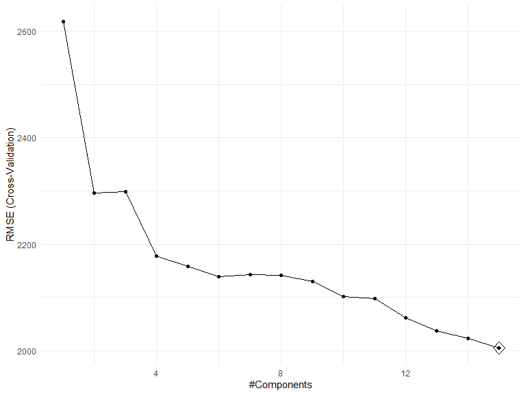
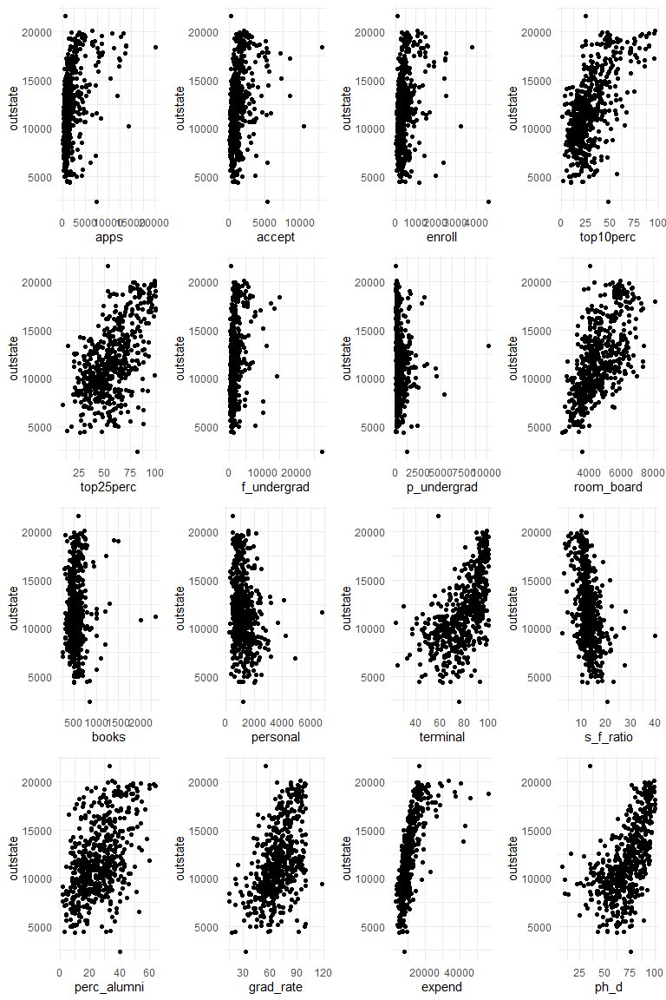

p8106\_hw2\_jsg2145
================
Jared Garfinkel
3/16/2020

``` r
collegedf = read_csv("./data/College.csv") %>% 
  janitor::clean_names() %>% 
  mutate(college = factor(college)) %>% 
  select(outstate, everything())
```

    ## Parsed with column specification:
    ## cols(
    ##   College = col_character(),
    ##   Apps = col_double(),
    ##   Accept = col_double(),
    ##   Enroll = col_double(),
    ##   Top10perc = col_double(),
    ##   Top25perc = col_double(),
    ##   F.Undergrad = col_double(),
    ##   P.Undergrad = col_double(),
    ##   Outstate = col_double(),
    ##   Room.Board = col_double(),
    ##   Books = col_double(),
    ##   Personal = col_double(),
    ##   PhD = col_double(),
    ##   Terminal = col_double(),
    ##   S.F.Ratio = col_double(),
    ##   perc.alumni = col_double(),
    ##   Expend = col_double(),
    ##   Grad.Rate = col_double()
    ## )

``` r
college.train = collegedf %>% 
  filter(college != "Columbia University")
```

``` r
x.train = model.matrix(outstate ~ apps + accept + enroll + top10perc + top25perc + f_undergrad + p_undergrad + room_board + books + personal + ph_d + terminal + s_f_ratio + perc_alumni + expend + grad_rate, college.train)[,-1]

y.train = pull(college.train, outstate)

ctrl1 = trainControl(method = "repeatedcv", number = 10, repeats = 5)
```

``` r
college.pcr = train(x.train, y.train,
                    method = "pcr",
                    tuneLength = ncol(college.train),
                    trControl = ctrl1,
                    preProc = c("center", "scale"))
```

``` r
ggplot(college.pcr, highlight = TRUE)
```



``` r
cv.lasso = cv.glmnet(x.train, y.train, 
                     type.measure = "mse", 
                     alpha = 1, 
                     lambda = exp(seq(2, 5, length = 100)))

plot(cv.lasso)
```


``` r
cv.ridge = cv.glmnet(x.train, y.train, 
                     type.measure = "mse", 
                     alpha = 0, 
                     lambda = exp(seq(3, 8, length = 100)))

plot(cv.ridge)
```


``` r
college.lasso = train(x.train, y.train,
                    method = "glmnet",
                    tuneGrid = expand.grid(alpha = 1, 
                                          lambda = exp(seq(2, 5, length = 100))),
                    trControl = ctrl1)
```

``` r
college.ridge = train(x.train, y.train,
                    method = "glmnet",
                    tuneGrid = expand.grid(alpha = 0, 
                                          lambda = exp(seq(3, 8, length = 100))),
                    trControl = ctrl1)
```

``` r
college.lm <- train(x.train, y.train,
                method = "lm",
                trControl = ctrl1)
```

``` r
resamp <- resamples(list(lasso = college.lasso, 
                         ridge = college.ridge, 
                         pcr = college.pcr,
                         lm = college.lm))

summary(resamp)
```

    ## 
    ## Call:
    ## summary.resamples(object = resamp)
    ## 
    ## Models: lasso, ridge, pcr, lm 
    ## Number of resamples: 50 
    ## 
    ## MAE 
    ##           Min.  1st Qu.   Median     Mean  3rd Qu.     Max. NA's
    ## lasso 1212.087 1480.659 1565.145 1579.420 1693.080 1892.239    0
    ## ridge 1319.013 1508.060 1615.116 1603.736 1673.145 2062.722    0
    ## pcr   1186.598 1479.860 1620.423 1607.024 1711.141 2103.052    0
    ## lm    1261.071 1503.010 1564.235 1598.403 1692.024 2172.381    0
    ## 
    ## RMSE 
    ##           Min.  1st Qu.   Median     Mean  3rd Qu.     Max. NA's
    ## lasso 1485.885 1832.578 1951.609 1979.452 2085.639 2581.706    0
    ## ridge 1568.336 1835.851 1977.004 1996.282 2085.068 2541.440    0
    ## pcr   1476.561 1839.319 1992.577 2012.759 2097.971 2954.131    0
    ## lm    1555.017 1832.480 1959.520 2002.623 2135.698 2779.039    0
    ## 
    ## Rsquared 
    ##            Min.   1st Qu.    Median      Mean   3rd Qu.      Max. NA's
    ## lasso 0.5259252 0.6883170 0.7299909 0.7205221 0.7649682 0.8362430    0
    ## ridge 0.5217365 0.6817300 0.7172004 0.7157346 0.7565336 0.8704111    0
    ## pcr   0.5394695 0.6802444 0.7160002 0.7124551 0.7576732 0.8260344    0
    ## lm    0.5233124 0.6804151 0.7252606 0.7154282 0.7678525 0.8188551    0

``` r
bwplot(resamp, metric = "RMSE")
```


``` r
p1 = college.train %>% 
  ggplot(aes(x = apps, y = outstate)) +
  geom_point()

p2 = college.train %>% 
  ggplot(aes(x = accept, y = outstate)) +
  geom_point()

p3 = college.train %>% 
  ggplot(aes(x = enroll, y = outstate)) +
  geom_point()

p4 = college.train %>% 
  ggplot(aes(x = top10perc, y = outstate)) +
  geom_point()

p5 = college.train %>% 
  ggplot(aes(x = top25perc, y = outstate)) +
  geom_point()

p6 = college.train %>% 
  ggplot(aes(x = f_undergrad, y = outstate)) +
  geom_point()

p7 = college.train %>% 
  ggplot(aes(x = p_undergrad, y = outstate)) +
  geom_point()

p8 = college.train %>% 
  ggplot(aes(x = room_board, y = outstate)) +
  geom_point()

p9 = college.train %>% 
  ggplot(aes(x = books, y = outstate)) +
  geom_point()

college.train %>% 
  ggplot(aes(x = ph_d, y = outstate)) +
  geom_point()
```


``` r
p10 = college.train %>% 
  ggplot(aes(x = personal, y = outstate)) +
  geom_point()

p11 = college.train %>% 
  ggplot(aes(x = terminal, y = outstate)) +
  geom_point()

p12 = college.train %>% 
  ggplot(aes(x = s_f_ratio, y = outstate)) +
  geom_point()

p13 = college.train %>% 
  ggplot(aes(x = perc_alumni, y = outstate)) +
  geom_point()

p14 = college.train %>% 
  ggplot(aes(x = grad_rate, y = outstate)) +
  geom_point()

p15 = college.train %>% 
  ggplot(aes(x = expend, y = outstate)) +
  geom_point() + 
  scale_x_continuous(breaks = c(0, 20000, 40000, 65000))
```

``` r
plots = list(p1, p2, p3, p4, p5, p6, p7, p8, p9, p10, p11, p12, p13, p14, p15)

wrap_plots(plots, ncol = 3)
```


