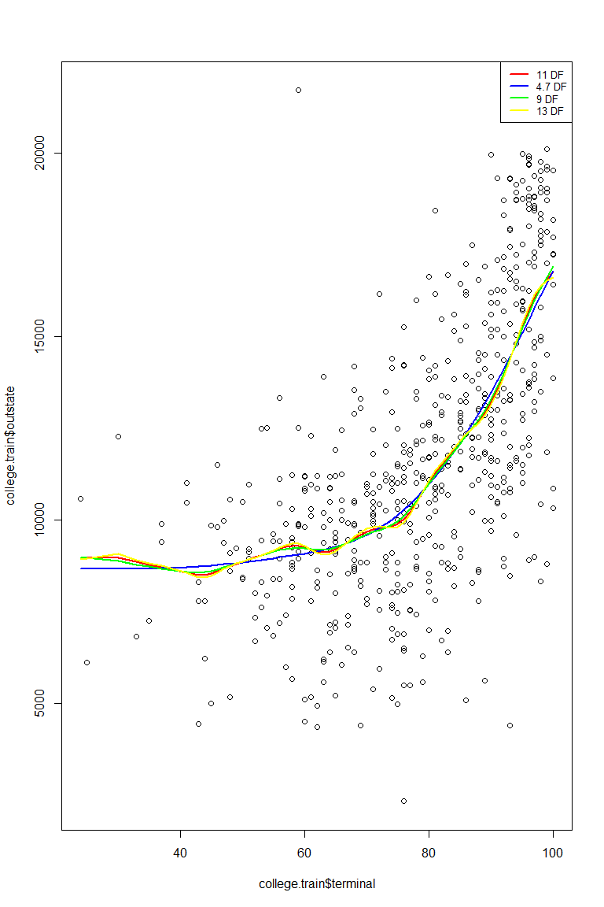
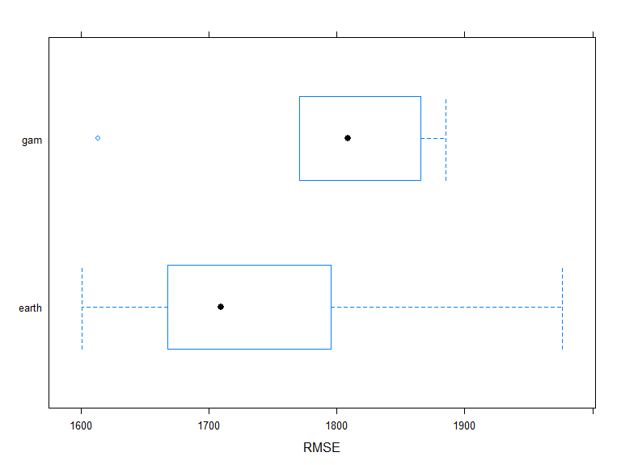

p8106\_hw2\_jsg2145
================
Jared Garfinkel
3/16/2020

``` r
collegedf = read_csv("./data/College.csv") %>% 
  janitor::clean_names() %>% 
  mutate(college = factor(college)) %>% 
  select(outstate, everything())
```

    ## Parsed with column specification:
    ## cols(
    ##   College = col_character(),
    ##   Apps = col_double(),
    ##   Accept = col_double(),
    ##   Enroll = col_double(),
    ##   Top10perc = col_double(),
    ##   Top25perc = col_double(),
    ##   F.Undergrad = col_double(),
    ##   P.Undergrad = col_double(),
    ##   Outstate = col_double(),
    ##   Room.Board = col_double(),
    ##   Books = col_double(),
    ##   Personal = col_double(),
    ##   PhD = col_double(),
    ##   Terminal = col_double(),
    ##   S.F.Ratio = col_double(),
    ##   perc.alumni = col_double(),
    ##   Expend = col_double(),
    ##   Grad.Rate = col_double()
    ## )

``` r
college.train = collegedf %>% 
  filter(college != "Columbia University")
```

``` r
x.train = model.matrix(outstate ~ apps + accept + enroll + top10perc + top25perc + f_undergrad + p_undergrad + room_board + books + personal + ph_d + terminal + s_f_ratio + perc_alumni + expend + grad_rate, college.train)[,-1]

y.train = pull(college.train, outstate)

ctrl1 = trainControl(method = "cv", number = 5)
```

``` r
p1 = college.train %>% 
  ggplot(aes(x = apps, y = outstate)) +
  geom_point()

p2 = college.train %>% 
  ggplot(aes(x = accept, y = outstate)) +
  geom_point()

p3 = college.train %>% 
  ggplot(aes(x = enroll, y = outstate)) +
  geom_point()

p4 = college.train %>% 
  ggplot(aes(x = top10perc, y = outstate)) +
  geom_point()

p5 = college.train %>% 
  ggplot(aes(x = top25perc, y = outstate)) +
  geom_point()

p6 = college.train %>% 
  ggplot(aes(x = f_undergrad, y = outstate)) +
  geom_point()

p7 = college.train %>% 
  ggplot(aes(x = p_undergrad, y = outstate)) +
  geom_point()

p8 = college.train %>% 
  ggplot(aes(x = room_board, y = outstate)) +
  geom_point()

p9 = college.train %>% 
  ggplot(aes(x = books, y = outstate)) +
  geom_point()

p16 = college.train %>% 
  ggplot(aes(x = ph_d, y = outstate)) +
  geom_point()

p10 = college.train %>% 
  ggplot(aes(x = personal, y = outstate)) +
  geom_point()

p11 = college.train %>% 
  ggplot(aes(x = terminal, y = outstate)) +
  geom_point()

p12 = college.train %>% 
  ggplot(aes(x = s_f_ratio, y = outstate)) +
  geom_point()

p13 = college.train %>% 
  ggplot(aes(x = perc_alumni, y = outstate)) +
  geom_point()

p14 = college.train %>% 
  ggplot(aes(x = grad_rate, y = outstate)) +
  geom_point()

p15 = college.train %>% 
  ggplot(aes(x = expend, y = outstate)) +
  geom_point() + 
  scale_x_continuous(breaks = c(0, 20000, 40000, 65000))
```

## Part a

``` r
plots = list(p1, p2, p3, p4, p5, p6, p7, p8, p9, p10, p11, p12, p13, p14, p15, p16)

wrap_plots(plots, ncol = 4)
```


\#\# Part b

``` r
spline.term9 = smooth.spline(pull(college.train, terminal), pull(college.train, outstate), df = 9)
spline.term10 = smooth.spline(pull(college.train, terminal), pull(college.train, outstate), df = 10)
spline.term11 = smooth.spline(pull(college.train, terminal), pull(college.train, outstate), df = 11)
spline.term12 = smooth.spline(pull(college.train, terminal), pull(college.train, outstate), df = 12)
spline.term13 = smooth.spline(pull(college.train, terminal), pull(college.train, outstate), df = 13)
spline.termA = smooth.spline(pull(college.train, terminal), pull(college.train, outstate), cv = TRUE)
spline.termA$df
```

    ## [1] 4.686019

``` r
plot(college.train$terminal, college.train$outstate)
points(x.train, cex = .5, 
       col = "darkgrey")
lines(spline.term11, col = "red ", lwd = 2)
lines(spline.termA, col = "blue", lwd = 2)
lines(spline.term9, col = "green", lwd = 2)
lines(spline.term13, col = "yellow", lwd = 2)
legend("topright", legend = c("11 DF", "4.7 DF", "9 DF", "13 DF"),
       col = c("red", "blue", "green", "yellow"), lty = 1, lwd = 2, cex = .8)
```



This graph shows a smoothing spline using cross validation to choose
degrees of freedom compared with various other degrees of freedom.

## Part c

``` r
gam1 = gam(outstate ~ apps + accept + enroll + top10perc + top25perc + f_undergrad + p_undergrad + room_board + books + personal + ph_d + terminal + s_f_ratio + perc_alumni + expend + grad_rate, data = college.train)
```

``` r
par(mfrow = c(4,4))
plot(gam1, pages=1,residuals=TRUE,all.terms=TRUE,shade=TRUE,shade.col=2)
```


The above graph shows a plot of the partial dependence of each predictor
in relation to the tuition.

``` r
vis.gam(gam1, view = c("apps", "accept"),
        plot.type = "contour", color = "topo")
```


This plot shows a contour of the dependence of two predictors on each
other.

``` r
set.seed(22)
college.gam = train(x.train, y.train,
                    method = "gam",
                    tuneGrid = data.frame(method = "GCV.Cp", 
                                         select = c(TRUE,FALSE)),
                    trControl = ctrl1)

college.gam$bestTune
```

    ##   select method
    ## 1  FALSE GCV.Cp

``` r
college.gam$finalModel
```

    ## 
    ## Family: gaussian 
    ## Link function: identity 
    ## 
    ## Formula:
    ## .outcome ~ s(perc_alumni) + s(terminal) + s(top10perc) + s(ph_d) + 
    ##     s(grad_rate) + s(books) + s(top25perc) + s(s_f_ratio) + s(personal) + 
    ##     s(p_undergrad) + s(enroll) + s(room_board) + s(accept) + 
    ##     s(f_undergrad) + s(apps) + s(expend)
    ## 
    ## Estimated degrees of freedom:
    ## 1.90 5.14 3.64 6.32 4.27 2.35 1.00 
    ## 4.33 1.00 1.00 1.00 2.13 3.58 6.28 
    ## 4.59 6.45  total = 55.98 
    ## 
    ## GCV score: 2761951

## Part d

``` r
mars_grid <- expand.grid(degree = 1:2, 
                         nprune = 2:16)

college.earth = train(x.train, y.train,
                       method = "earth", tuneGrid = mars_grid, trControl = ctrl1)
```

    ## Loading required package: earth

    ## Loading required package: Formula

    ## Loading required package: plotmo

    ## Loading required package: plotrix

    ## Loading required package: TeachingDemos

``` r
ggplot(college.earth)
```


``` r
partial(college.earth, pred.var = "expend", plot = TRUE, rug = TRUE)
```


``` r
college.earth$bestTune
```

    ##    nprune degree
    ## 15     16      1

``` r
coef(college.earth$finalModel) 
```

    ##         (Intercept)     h(expend-15365)  h(4450-room_board) 
    ##       11157.3323100          -0.6964270          -1.2721516 
    ##     h(grad_rate-97)     h(97-grad_rate) h(f_undergrad-1355) 
    ##        -242.9852028         -24.1380627          -0.3567241 
    ## h(1355-f_undergrad)   h(22-perc_alumni)        h(apps-3712) 
    ##          -1.7564383         -77.0359905           7.0815293 
    ##    h(1300-personal)       h(913-enroll)      h(2193-accept) 
    ##           1.0492662           5.2944664          -1.9951560 
    ##      h(expend-6881)        h(apps-3877)   h(s_f_ratio-10.1) 
    ##           0.6896165          -6.7393719         -97.7224105 
    ##   h(s_f_ratio-17.8) 
    ##         222.5913868

Using multivariate adaptive regression spline (MARS), a final model is
-0.745*“expend” - 1.294*“room\_board” - 21.71*“grad\_rate” -
0.337*“f\_undergrad” - 1.442*“f\_undergrad” - 79.612*“perc\_alumni” +
0.417*“apps” + 0.947*“personal” + 4.572*“enroll” - 1.922*“accept” +
0.745\*“expend.”

``` r
resamp <- resamples(list(earth = college.earth,
                         gam = college.gam))

summary(resamp)
```

    ## 
    ## Call:
    ## summary.resamples(object = resamp)
    ## 
    ## Models: earth, gam 
    ## Number of resamples: 5 
    ## 
    ## MAE 
    ##           Min.  1st Qu.   Median     Mean  3rd Qu.     Max. NA's
    ## earth 1304.020 1308.502 1351.310 1359.150 1367.087 1464.831    0
    ## gam   1305.207 1369.317 1376.875 1384.362 1393.167 1477.245    0
    ## 
    ## RMSE 
    ##           Min.  1st Qu.   Median     Mean  3rd Qu.     Max. NA's
    ## earth 1600.466 1667.612 1709.368 1749.716 1794.982 1976.150    0
    ## gam   1613.150 1770.887 1808.560 1788.702 1865.690 1885.225    0
    ## 
    ## Rsquared 
    ##            Min.   1st Qu.    Median      Mean   3rd Qu.      Max. NA's
    ## earth 0.7487180 0.7546039 0.7868256 0.7838266 0.8063247 0.8226606    0
    ## gam   0.7228419 0.7489326 0.7796175 0.7721217 0.7929478 0.8162689    0

``` r
bwplot(resamp, metric = "RMSE")
```


\#\# Part e

``` r
columbia = collegedf %>% 
  filter(college == "Columbia University")

pred.earth = predict(college.earth, newdata = columbia)

pred.gam = predict(gam1, newdata = columbia)
```

The MARS model predicts a tuition of 1.852110^{4} dollars and the GAM
model predicts a tuition of 1.94417610^{4} dollars. Because the MARS
model has a lower RMSE it is appropriate to accept this model and
predict a tuition of 1.852110^{4} dollars.
